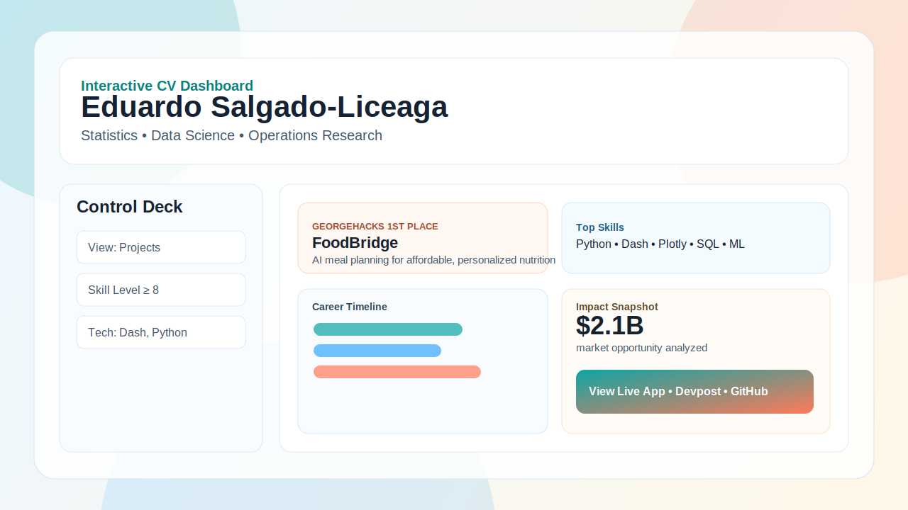
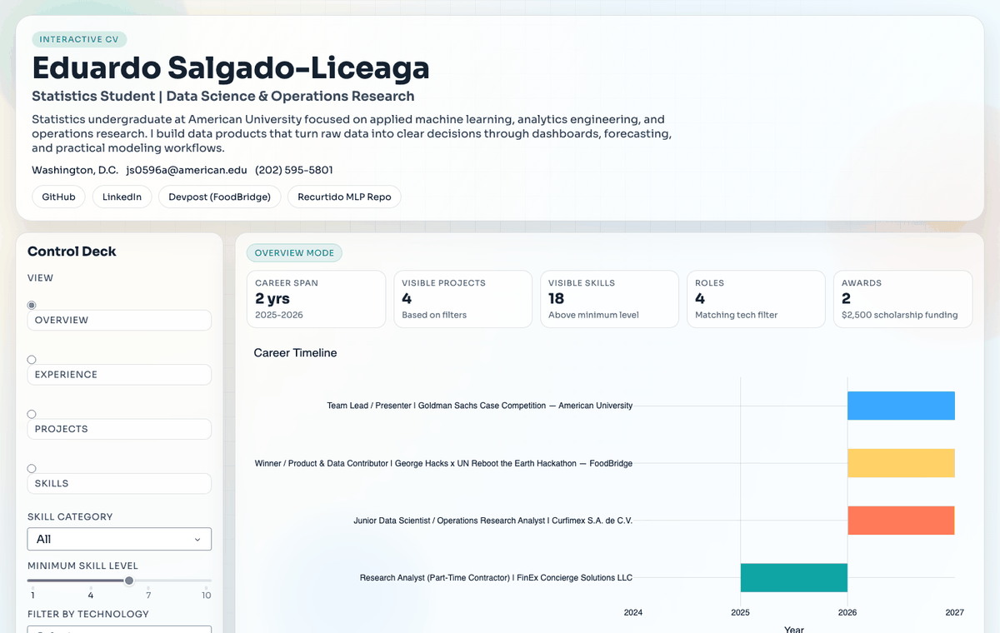
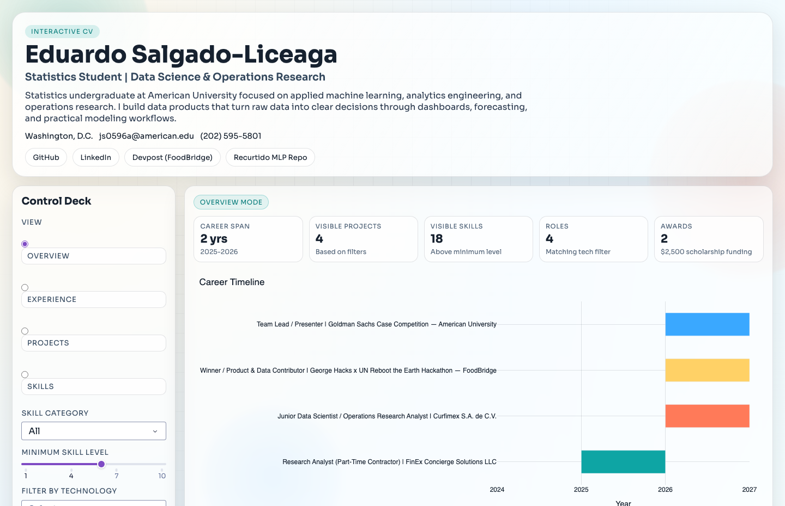
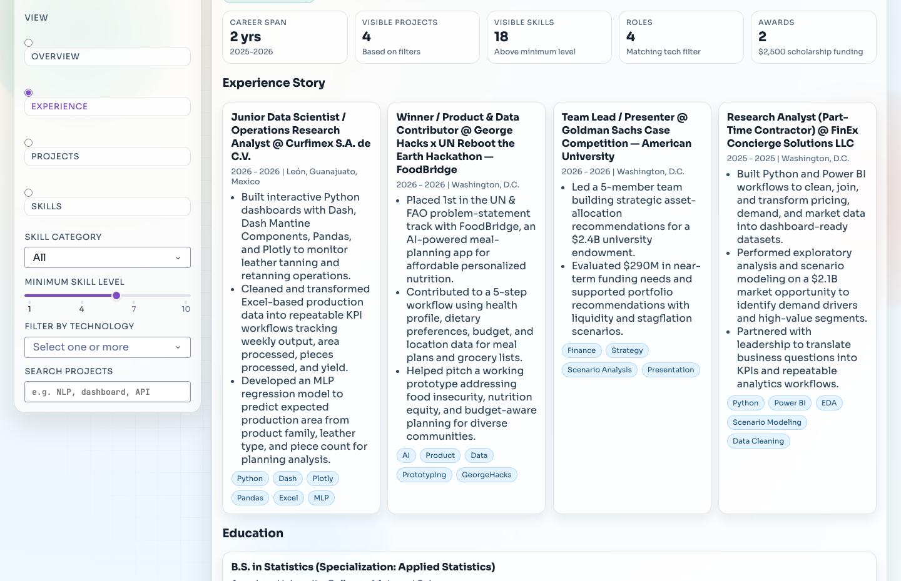
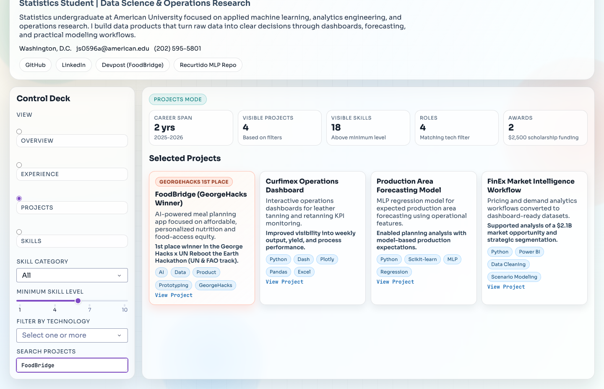
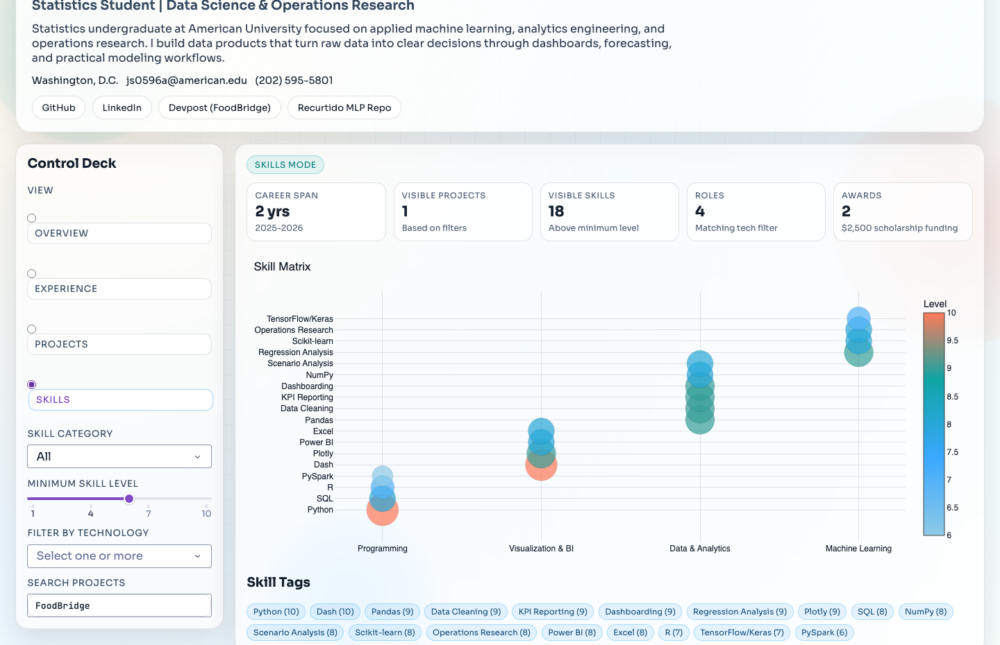
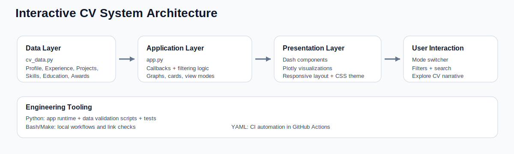

# Interactive CV Dashboard





If GIF autoplay feels too fast in your browser, use the static walkthrough screenshots:






Interactive, recruiter-facing CV product built with Dash + Plotly and engineered like a software project.

[](https://www.python.org/)
[](https://dash.plotly.com/)
[](https://plotly.com/python/)

## Recruiter Snapshot

- Config-driven resume app with live filtering and storytelling views
- Data-to-UI pipeline from structured CV data to interactive charts/cards
- Engineering workflow includes validation scripts, tests, Make targets, and CI

## Demo Assets

- Architecture image: `docs/cv-dashboard-preview.svg`
- Live app demo GIF: `docs/cv-dashboard-demo.gif`
- Walkthrough screenshots: `docs/screenshots/`
- System architecture diagram: `docs/cv-architecture.svg`
- Architecture notes: `docs/ARCHITECTURE.md`



## Software Engineering Stack

- Python: application runtime, callback logic, validation scripts, tests
- CSS: custom visual system and responsive layout
- Bash: link validation utility
- Makefile: reproducible local workflows
- YAML (GitHub Actions): CI automation

## Project Structure

```text
.
├── app.py
├── cv_data.py
├── assets/
│   └── styles.css
├── docs/
│   ├── ARCHITECTURE.md
│   ├── cv-architecture.svg
│   ├── cv-dashboard-demo.gif
│   ├── cv-dashboard-preview.svg
│   └── screenshots/
│       ├── 01-overview.png
│       ├── 02-experience-awards.png
│       ├── 03-projects-foodbridge.png
│       └── 04-skills.png
├── scripts/
│   ├── capture_demo.py
│   ├── check_links.sh
│   └── validate_cv_data.py
├── tests/
│   └── test_cv_data_contract.py
├── requirements.txt
├── requirements-dev.txt
├── Makefile
└── .github/workflows/ci.yml
```

## One Copy-Paste Setup + Run (macOS/Linux)

```bash
git clone https://github.com/js0596a/interactive-cv-dashboard.git
cd interactive-cv-dashboard
python3 -m venv .venv
source .venv/bin/activate
python -m pip install --upgrade pip
pip install -r requirements.txt
python app.py
```

Open `http://127.0.0.1:8050`

If port `8050` is busy, run:

```bash
python -c "from app import app; app.run(debug=True, port=8051)"
```

## Engineering Workflow

Install dev tools:

```bash
pip install -r requirements-dev.txt
python -m playwright install chromium
```

Run data validation + syntax checks:

```bash
python scripts/validate_cv_data.py
python -m py_compile app.py cv_data.py
```

Run tests:

```bash
pytest -q
```

Run link checks:

```bash
bash scripts/check_links.sh
```

Generate/refresh demo GIF:

```bash
python scripts/capture_demo.py
```

## Make Targets

```bash
make install
make install-dev
make check
make test
make run
make demo-gif
```

## Featured Profile Links

- LinkedIn: [linkedin.com/in/edu-sal](https://linkedin.com/in/edu-sal)
- GitHub: [github.com/js0596a](https://github.com/js0596a)
- Devpost: [FoodBridge](https://devpost.com/software/food-bridge-isqzu0)
- Recurtido MLP Repo: [recurtido-mlp-dashboard](https://github.com/js0596a/recurtido-mlp-dashboard)

## Note

The demo GIF uses your current public CV app content and does not include any private company datasets.
