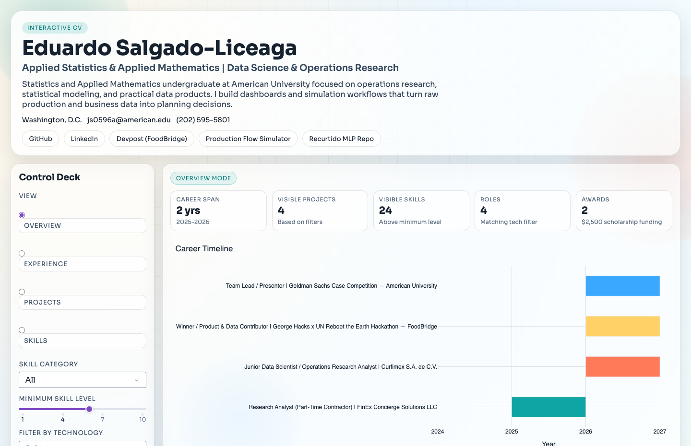
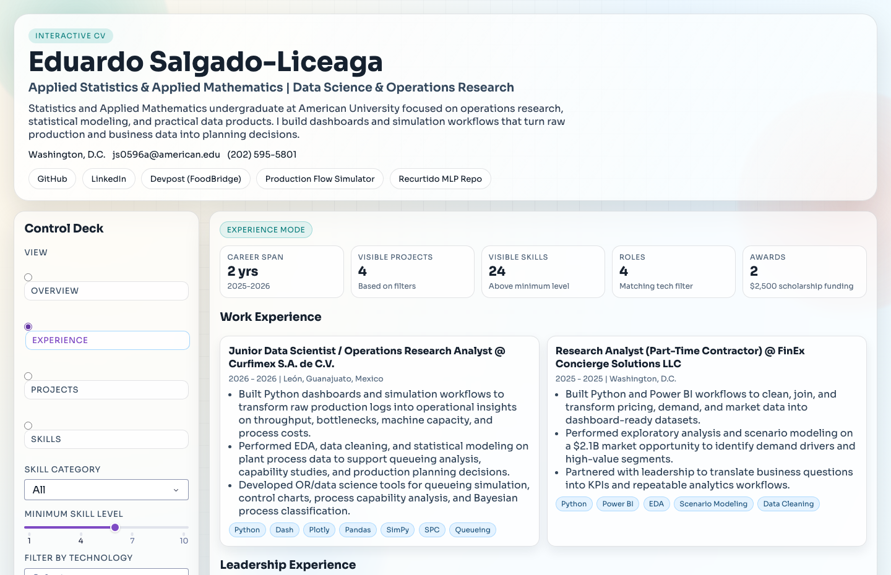
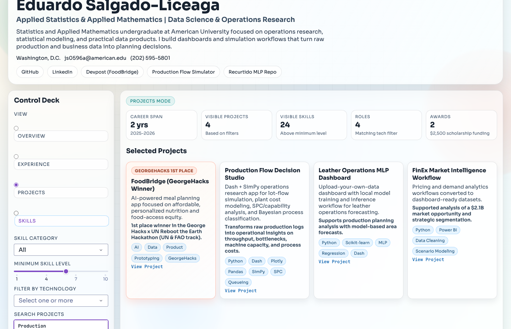
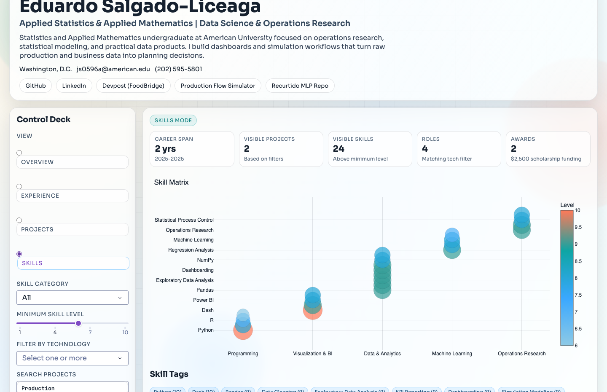

# Interactive CV Dashboard

This is my resume as an interactive Dash app.

The app presents my education, work experience, leadership experience, projects, skills, and awards in a format that is easier to explore than a static PDF. I use it as a portfolio companion to my resume, especially for showing the technical projects behind my operations research, analytics, and machine learning experience.

## Quick Look









## Resume Focus

The current version reflects my updated resume focus:

- Applied Statistics & Applied Mathematics student at American University.
- Data Scientist experience at Curfimex S.A. de C.V.
- Production-flow simulation, queueing analysis, cost modeling, control charts, capability analysis, and Bayesian process classification.
- Data Analyst experience through FinEx Concierge Solutions LLC.
- Leadership/project experience through FoodBridge and the Goldman Sachs Case Competition.

## What The App Shows

- Overview: profile summary, contact links, and quick stats.
- Experience: work and leadership cards with role highlights.
- Projects: searchable project list with links to repositories and external work.
- Skills: grouped technical and analytical skills.
- Awards: scholarships and academic recognition.

## Featured Project Alignment

The app now includes the same Curfimex language used in my resume:

- Built Python dashboards and simulation workflows to transform raw production logs into operational insights on throughput, bottlenecks, machine capacity, and process costs.
- Performed EDA, data cleaning, and statistical modeling on plant process data to support queueing analysis, capability studies, and production planning decisions.
- Developed data science tools for queueing simulation, control charts, process capability analysis, and Bayesian process classification.

## Tech Stack

- Python
- Dash
- Plotly
- Pandas
- Git/GitHub
- Docker
- CSS
- Pytest

## Run It

```bash
git clone https://github.com/js0596a/interactive-cv-dashboard.git
cd interactive-cv-dashboard
python3 -m venv .venv
source .venv/bin/activate
python -m pip install --upgrade pip
pip install -r requirements.txt
python app.py
```

Open:

```text
http://127.0.0.1:8050
```

If `8050` is busy:

```bash
python -c "from app import app; app.run(debug=True, port=8051)"
```

## Main Links

- Production Flow Decision Studio: [github.com/js0596a/empirical-lot-cost-simulator](https://github.com/js0596a/empirical-lot-cost-simulator)
- Leather Operations MLP Dashboard: [github.com/js0596a/recurtido-mlp-dashboard](https://github.com/js0596a/recurtido-mlp-dashboard)
- FoodBridge / GeorgeHacks: [devpost.com/software/food-bridge-isqzu0](https://devpost.com/software/food-bridge-isqzu0)
- LinkedIn: [linkedin.com/in/edu-sal](https://linkedin.com/in/edu-sal)

## Note

This repo is public-safe and does not include private company datasets.
